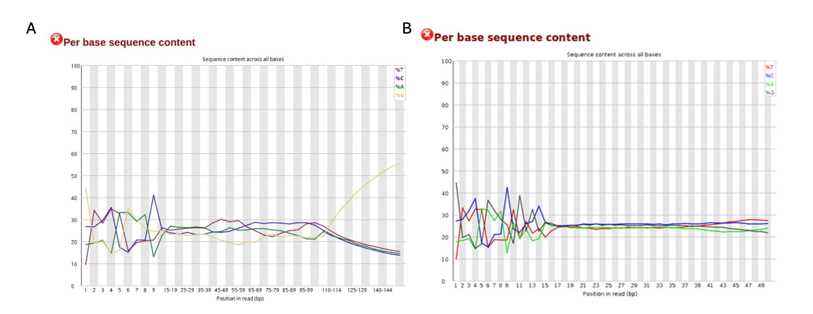
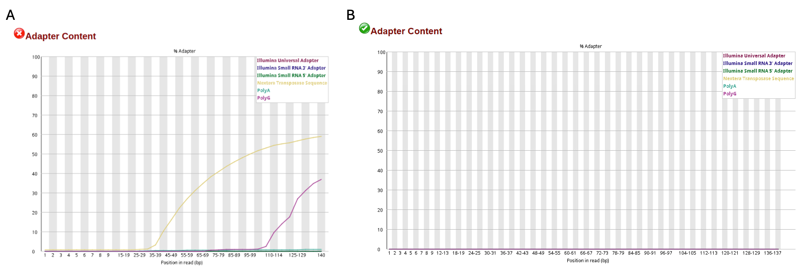
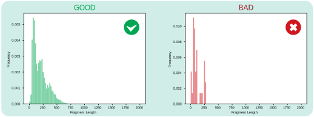
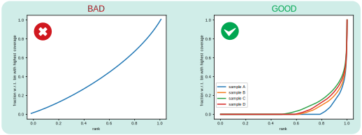

# ATAC-seq Snakemake Pipeline

A modular Snakemake pipeline for paired-end ATAC-seq from raw FASTQ to peaks, signal tracks, and QC reports.

This repository currently uses:
- `workflow/Snakefile`
- `config/config.yml`
- per-rule Conda environments in `workflow/envs/`

## Pipeline Summary

Main workflow (per sample):
1. Merge lanes by `sample_id` (from samplesheet)
2. Raw FastQC
3. Trimming (`fastp` or `trim_galore`)
4. Alignment (`bwa` = BWA-MEM2, or `bowtie2`)
5. Re-mark duplicates (Picard MarkDuplicates; optional by config)
6. BAM filtering to produce `*.filtered.bam`
7. BAM stats on filtered BAM (`samtools stats/flagstat/idxstats`)
8. Signal tracks
   - Scaled bedGraph + bigWig from filtered BAM
   - ATAC-shifted BAM + shifted RPGC bigWig
9. Peak calling (MACS3 with Tn5-shifted BED)
10. Peak QC summary plots (`plot_macs2_qc.r`)
11. FRiP + MultiQC-ready FRiP / peak-count TSV
12. Peak annotation (HOMER + summary)
13. featureCounts in peaks (SAF)
14. deepTools matrix/profile/heatmap/fingerprint
15. ataqv JSON + mkarv HTML report
16. MultiQC
17. Cleanup temporary/intermediate FASTQ files

## Workflow DAG

Pipeline flow (per sample):

```text
samplesheet + reference prep
        |
        v
merge_raw_fastqs
        |
        +--> fastqc_raw
        |
        v
trimming (fastp | trim_galore)
        |
        +--> fastqc_trimmed (trim_galore mode)
        |
        v
alignment (bwa-mem2 | bowtie2)
        |
        v
sort_bam
        |
        v
mark_duplicates (optional)
        |
        v
bam_filter  --->  filtered.bam / filtered.bam.bai
        |                    |
        |                    +--> align_stats (samtools stats/flagstat/idxstats)
        |                    +--> bedtools_genomecov -> bedGraphToBigWig -> bigWig
        |                    +--> shift_bam -> shifted.bam + shifted.bigWig
        |                    +--> filtered.bam -> bamtobed + Tn5 shift -> *.tn5_shifted.bed -> macs3_callpeak_tn5
        |                               |
        |                               +--> frip_score (+ MultiQC TSVs)
        |                               +--> macs3_peak_qc_plot 
        |                               +--> annotate_peaks (optional)
        |                               +--> featurecounts_in_peaks (optional; uses shifted.bam)
        |                               +--> ataqv -> ataqv_mkarv (optional)
        |                    +--> deeptools (optional; uses shifted.bigWig / shifted.bam)
        |
        v
multiqc
        |
        v
delete_tmp
```

## Requirements

- Linux
- Snakemake (recommended in a controller env)
- Conda/Mamba

Example controller environment:

```bash
mamba create -n atacseq_snakemake -c conda-forge -c bioconda snakemake
mamba activate atacseq_snakemake
```

Then run workflow rules with `--use-conda` so each rule uses its own env from `workflow/envs/*.yml`.

## Installation

```bash
git clone https://github.com/UKHD-NP/atacseq_snakemake.git
cd atacseq_snakemake
```

## Input Files

### 1. Samplesheet

`config/config.yml` key: `samples_csv`

Required columns:
- `sample_id`
- `fq1`
- `fq2`
- `outdir`

Example:

```csv
sample_id,fq1,fq2,outdir
S1,/data/S1_L001_R1.fastq.gz,/data/S1_L001_R2.fastq.gz,results/S1
S1,/data/S1_L002_R1.fastq.gz,/data/S1_L002_R2.fastq.gz,results/S1
S2,/data/S2_R1.fastq.gz,/data/S2_R2.fastq.gz,results/S2
```

Notes:
- Repeated `sample_id` rows are treated as lanes and merged.
- Even with a single lane/sample, the pipeline still runs `merge_raw_fastqs` (symlink mode), so merged FASTQ filenames still use the `*_merged_*` suffix.
- All rows for the same `sample_id` must have the same `outdir`.

### 2. Reference

Set in `config/config.yml -> ref`.

- `assembly`: `hg19`, `hg38`, `m39`, or `custom`
- For `custom`, provide:
  - `ref.fasta`
  - `ref.gtf`
  - `ref.blacklist`

Pipeline stages references into `references/{assembly}/` and derives:
- `.fai`, `.sizes` (`chromsizes`), `.autosomes.txt`, `.tss.bed`, `.include_regions.bed`

## Run

Dry run:

```bash
snakemake -s workflow/Snakefile --configfile config/config.yml --use-conda -n
```

Run:

```bash
snakemake -s workflow/Snakefile --configfile config/config.yml --use-conda --cores 24 --rerun-incomplete
```

Optional:

```bash
snakemake -s workflow/Snakefile --configfile config/config.yml --use-conda --cores 24 --latency-wait 60
```

## Key Configuration

Below is the default-style config block with practical explanation:

```yaml
# Path to samplesheet CSV (columns: sample_id, fq1, fq2, outdir)
samples_csv: "test_data/samplesheet_test.csv"

ref:
  assembly: "custom"            # hg19 / hg38 / m39 / custom
  fasta: "test_data/references/genome.fa"
  gtf: "test_data/references/genes.gtf"
  blacklist: "test_data/references/ce11-blacklist.v2.bed"
  bwa_index: ""                 # optional prebuilt BWA prefix; auto-generated if empty
  bowtie2_index: ""             # optional prebuilt Bowtie2 prefix; auto-generated if empty
  mito_name: "MT"               # mitochondrial contig name used by filtering/ataqv
  keep_mito: false              # keep mitochondrial reads in include_regions or not

trimming:
  enabled: true
  tool: "trim_galore"           # fastp / trim_galore
  trim_galore_params: "--nextseq 25 --length 36"
  fastp_params: "--cut_tail --cut_tail_window_size 4 --cut_tail_mean_quality 25 --trim_poly_g --length_required 36"

align:
  tool: "bowtie2"               # bwa / bowtie2
  bowtie2_params: "--very-sensitive --no-discordant -p 2 -X 2000"
  bwa_params: "-I 0,2000"

bam_filter:
  enabled: true
  params: "-F 0x004 -F 0x0008 -f 0x001 -F 0x0100 -F 0x0400 -q 30"

markduplicates:
  enabled: true

deeptools:
  enabled: true

call_peaks:
  enabled: true
  peak_type: "narrow"           # narrow / broad
  macs3_gsize: "2701262066"     # effective genome size (preferred); if empty, auto-sum from chromsizes
  macs3_narrow_params: "--trackline --shift 75 --extsize 150 --keep-dup all --nomodel --call-summits -q 0.01"
  macs3_broad_params: "--trackline --shift 75 --extsize 150 --keep-dup all --nomodel --broad --broad-cutoff 0.1"
  frip_overlap_fraction: 0.2

annotate_peaks:
  enabled: true

feature_counts:
  enabled: true
  use_shifted_bam: true         # true = count from shifted.bam, false = filtered.bam

ataqv:
  enabled: true

multiqc:
  config: "workflow/scripts/multiqc_config.yml"

latency-wait: 60
```

Explanation by block:
- `samples_csv`: input table for sample discovery and lane merging.
- `ref`: reference genome/annotation source. For `custom`, paths are required. `bwa_index` / `bowtie2_index` can be left empty to auto-build.
- `trimming`: choose one trimming engine and pass tool-specific options.
- `align`: choose aligner and set aligner-specific CLI parameters.
- `bam_filter.params`: core read-quality filtering flags (unmapped/secondary/duplicates/MAPQ etc.).
- `markduplicates.enabled`: run Picard MarkDuplicates before filtering.
- `deeptools.enabled`: run computeMatrix/plotProfile/plotHeatmap/plotFingerprint modules.
- `call_peaks`: MACS3 behavior and FRiP overlap threshold.
- `annotate_peaks.enabled`: run HOMER annotatePeaks and summary plotting.
- `feature_counts.use_shifted_bam`: useful for ATAC peak counting strategy; enabled by default.
- `ataqv.enabled`: run ATAC-specific QC (`ataqv`) and render HTML (`mkarv`).
- `multiqc.config`: path to MultiQC config used by this pipeline.
- `latency-wait`: useful on slow filesystems to avoid false missing-output errors.

### Why these default params were chosen

- `trimming.tool: trim_galore` with `--nextseq 25 --length 36`:
  chosen for two-color Illumina runs (poly-G prone) and to remove very short reads that are usually uninformative for peak calling.
- `align.tool: bowtie2` with `--very-sensitive --no-discordant -X 2000`:
  chosen to maximize paired-end sensitivity while constraining improbable pair structure for ATAC fragment lengths.
- `bam_filter.params: ... -q 30`:
  chosen as a relatively strict default to retain high-confidence alignments for downstream peak calling and signal tracks.
- `call_peaks` defaults (`--shift 75 --extsize 150 --nomodel`):
  chosen to reflect ATAC Tn5 insertion behavior and common MACS3 ATAC settings.
- `feature_counts.use_shifted_bam: true`:
  chosen to count reads against peaks using the same ATAC-shifted representation used by deepTools signal modules.

### How to choose `macs3_gsize`

- `macs3_gsize` is passed to MACS3 as `--gsize`.
- Prefer effective genome size values from deepTools documentation:  
  `https://deeptools.readthedocs.io/en/latest/content/feature/effectiveGenomeSize.html`
- If `macs3_gsize` is empty, this pipeline falls back to summing chromosome sizes from `ref.chromsizes`.
- Common values (from deepTools table):
  - `hg19`: `2864785220`
  - `hg38`: `2913022398`
  - `mm10`: `2652783500`

## Module Dependencies (important)

- `call_peaks` targets are only active when `bam_filter.enabled=true`.
- `deeptools` targets are only active when `bam_filter.enabled=true`.
- `align_stats` targets are only active when `bam_filter.enabled=true`.
- `ataqv` requires `call_peaks.enabled=true`.
- `feature_counts` targets require `call_peaks.enabled=true`.

## Re-mark Duplicates and BAM Filtering Criteria

After alignment and coordinate sorting, duplicates are marked with Picard (`mark_duplicates`, when enabled), then `bam_filter` creates `*.filtered.bam`.

Important: `bam_filter.params` is the **SAMtools core filter only**.  
Additional filters are applied by BAMTools and Pysam (if available in the runtime env).

### 1) SAMtools core filter (from `config.yml`)

Current default:

`-F 0x004 -F 0x0008 -f 0x001 -F 0x0100 -F 0x0400 -q 30`

Meaning:
- `-F 0x004`: remove unmapped reads
- `-F 0x0008`: remove reads whose mate is unmapped
- `-f 0x001`: keep only reads flagged as paired
- `-F 0x0100`: remove secondary alignments
- `-F 0x0400`: remove reads marked as duplicates
- `-q 30`: keep reads with MAPQ >= 30 (remove lower-confidence multimappers/ambiguous mappings)

`bam_filter` also uses `-L ref.include_regions` with `samtools view`:
- this keeps only mappable regions outside blacklist intervals
- mitochondrial contig can be excluded there when `ref.keep_mito: false`

### 2) BAMTools extra filter (optional but enabled when `bamtools` exists)

From `workflow/scripts/bamtools_filter_pe.json`, extra constraints are:
- mismatches `NM <= 4`
- remove soft-clipped reads (`CIGAR` containing `S`)
- keep insert size in `[-2000, 2000]`

### 3) Pysam pair/orphan cleanup (optional but enabled when `python3+pysam` exists)

From `workflow/scripts/bampe_rm_orphan.py` (`--only_fr_pairs` mode):
- remove singleton/orphan reads
- keep only read pairs on the same chromosome
- keep only FR-oriented proper pairs
- remove pairs where one mate fails the pair criteria

Why this default filtering strategy is used:
- It prioritizes specificity for ATAC peak detection.
- It reduces noisy alignments before MACS3, FRiP, and bigWig generation.
- It is a practical strict default (`-q 30`); for low-depth data you can relax to `-q 20`.

## Main Outputs

Per sample under `<outdir>`:

- BAM / stats
  - `bam/{sample}.filtered.bam`
  - `bam/{sample}.filtered.bam.bai`
  - `bam/{sample}.filtered.bam.stats`
  - `bam/{sample}.filtered.bam.flagstat`
  - `bam/{sample}.filtered.bam.idxstats`
- Peaks / FRiP
  - `peaks/{sample}_peaks.peak`
  - `peaks/{sample}_peaks.xls`
  - `peaks/{sample}.FRiP.txt`
  - `peaks/{sample}_peaks.FRiP_mqc.tsv`
  - `peaks/{sample}_peaks.count_mqc.tsv`
  - `peaks/{sample}.macs_peakqc.summary.txt`
  - `peaks/{sample}.macs_peakqc.plots.pdf`
- Annotation
  - `annotation/{sample}_peaks.annotatePeaks.txt`
  - `annotation/{sample}.macs_annotatePeaks.summary.txt`
- Peak counts
  - `featurecounts/{sample}_peaks.saf`
  - `featurecounts/{sample}.readCountInPeaks.txt`
  - `featurecounts/{sample}.readCountInPeaks.txt.summary`
- Signal tracks
  - `bigwig/{sample}.bigWig`
  - `bam/{sample}.shifted.bam`
  - `bam/{sample}.shifted.bam.bai`
  - `bigwig/{sample}.shifted.bigWig`
- deepTools
  - `deeptools/*.computeMatrix.*`
  - `deeptools/*.plotProfile.*`
  - `deeptools/*.plotHeatmap.*`
  - `deeptools/*.plotFingerprint.*`
- ataqv
  - `ataqv/{sample}.ataqv.json`
  - `ataqv/{sample}.mkarv_html/index.html`
- MultiQC
  - `multiqc/{sample}.multiqc.html`

## MultiQC Content

`workflow/scripts/multiqc_config.yml` is configured for:
- Raw and trimmed read QC
- Samtools filtered-BAM stats
- Picard MarkDuplicates
- deepTools QC metrics
- ataqv JSON
- FRiP table (`*_peaks.FRiP_mqc.tsv`)
- Peak count table (`*_peaks.count_mqc.tsv`)
- HOMER annotation summary
- MACS peak QC summary

## QC Visual Guide (from `resources/`)

### 1. FastQC base composition



How to read:
- Raw ATAC-seq data can show end-bias and poly-G artifacts (especially on two-color chemistry platforms).
- After trimming, base-content curves should be more stable and less biased at read ends.

### 2. Adapter-content profile



How to read:
- Before trimming, adapter contamination can be high at read tails.
- After trimming, adapter signal should drop strongly (ideally near zero across most cycles).

### 3. Fragment-size distribution



How to read:
- Good ATAC libraries usually show a nucleosome-free peak (short fragments) plus mono-/di-nucleosome periodic peaks.
- A flat/noisy pattern without clear peaks often indicates lower signal quality.

### 4. Fingerprint / library complexity trend



How to read:
- Curves help assess enrichment and library complexity.
- Better enrichment typically separates signal from background more clearly.

## ENCODE QC Benchmarks

Key metrics from ENCODE (practical targets and acceptable ranges):
- Alignment rate: target `>95%` (acceptable `>80%`)
- FRiP score: target `>0.3` (acceptable `>0.2`)
- TSS enrichment: target `>10` (acceptable `>5`)
- Library complexity (NRF): target `>0.9`
- PBC1: target `>0.9`
- PBC2: target `>3`
- Nucleosome-free regions: should be detectable in called peaks

## Space-saving behavior

Pipeline removes some intermediates to reduce storage, for example:
- unsorted BAM after sort
- pre-filter BAM after filtering
- merged/trimmed FASTQ files in cleanup step after MultiQC

## Troubleshooting

- `MissingInputException` in MultiQC:
  - check module toggles and corresponding outputs
  - run dry-run first
- Rule env issues:
  - ensure `--use-conda`
  - delete broken env under `.snakemake/conda/` and rerun
- Large runs:
  - increase `--cores`
  - tune per-rule params in config (aligner/deeptools/featureCounts)

## Acknowledgments

A huge thank you to Dr. Isabell Bludau, Dr.med.Abigail Suwala, Dr. Paul Kerbs, Quynh Nhu Nguyen and Temesvari-Nagy Levente from Heidelberg University Hospital and the German Cancer Research Center (DKFZ) for their support, feedback, and contributions to this pipeline.

## License

Follow the repository [MIT License](MIT_License.md) and tool licenses used in `workflow/envs/`.
